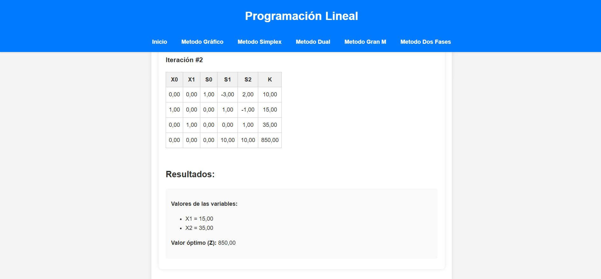

# Software Educativo de Programación Lineal

Este proyecto es una aplicación web desarrollada con Django para resolver problemas de programación lineal utilizando varios métodos algorítmicos.

## 🎯 Características

- **Método Gráfico:** Visualización de soluciones para problemas de dos variables con descarga de script ejecutable
- **Método Simplex:** Resolución de problemas de programación lineal mediante el algoritmo Simplex, mostrando las tablas de iteración paso a paso
- **Método Dual:** Implementación del método Dual para problemas de programación lineal
- **Método Gran M:** Resolución de problemas con restricciones de igualdad o mayor-igual
- **Método Dos Fases:** Abordaje de problemas complejos que requieren una fase inicial para encontrar una solución básica factible

## 🖼️ Demostración del Proyecto



**Descripción de la imagen:** La captura de pantalla muestra la interfaz de la aplicación web "Programación Lineal" con los resultados de una iteración del método Simplex. Se puede observar:

- **Encabezado:** Barra azul con el título "Programación Lineal"
- **Navegación:** Enlaces a todos los métodos disponibles (Gráfico, Simplex, Dual, Gran M, Dos Fases)
- **Tabla de Iteración:** Muestra la iteración #2 con variables X0, X1 y variables de holgura S0, S1, S2
- **Resultados Finales:** Valores óptimos de las variables (X1 = 15,00, X2 = 35,00) y valor óptimo de la función objetivo (Z = 850,00)

## 🏗️ Estructura del Proyecto

```
ProyectoMetodosLineales/
├── softwareducativo/          # Configuración principal de Django
│   ├── settings.py           # Configuración del proyecto
│   ├── urls.py              # Rutas principales
│   └── wsgi.py              # Configuración WSGI
├── metodos/                 # Aplicación principal
│   ├── views.py             # Lógica de las vistas para cada método
│   ├── templates/           # Archivos HTML para la interfaz
│   │   ├── base.html        # Plantilla base
│   │   ├── index.html       # Página principal
│   │   ├── metodosimplex.html
│   │   ├── metododual.html
│   │   ├── metodogranm.html
│   │   ├── metododosfases.html
│   │   └── metodografico.html
│   ├── static/              # Recursos estáticos
│   │   ├── css/style.css    # Estilos CSS
│   │   └── images/          # Imágenes
│   └── desarrolloMetodos/   # Algoritmos de programación lineal
│       ├── metodoSimplex.py
│       ├── metodoDual.py
│       ├── MetodoGranM.py
│       ├── MetodoDosFaces.py
│       └── MetodoGrafico.py
├── requirements.txt         # Dependencias del proyecto
└── manage.py               # Script de gestión de Django
```

## 🚀 Instalación y Ejecución

### Requisitos

- Python 3.8+
- pip

### Pasos de Instalación

1. **Clonar el repositorio:**
   ```bash
   git clone <URL_DEL_REPOSITORIO>
   cd ProyectoMetodosLineales
   ```

2. **Crear y activar el entorno virtual:**
   ```bash
   python -m venv venv
   # En Windows:
   venv\Scripts\activate
   # En macOS/Linux:
   source venv/bin/activate
   ```

3. **Actualizar pip:**
   ```bash
   python.exe -m pip install --upgrade pip
   ```

4. **Instalar dependencias:**
   ```bash
   pip install -r requirements.txt
   ```

5. **Ejecutar migraciones de la base de datos:**
   ```bash
   python manage.py migrate
   ```

6. **Iniciar el servidor de desarrollo:**
   ```bash
   python manage.py runserver
   ```

   La aplicación estará disponible en `http://127.0.0.1:8000/`

## 📚 Uso de la Aplicación

### Método Simplex
1. Navega a "Metodo Simplex"
2. Ingresa el número de variables y restricciones
3. Selecciona el tipo de optimización (maximizar/minimizar)
4. Completa la función objetivo y las restricciones
5. Visualiza las tablas de iteración y resultados

### Método Gráfico
1. Navega a "Metodo Gráfico"
2. Descarga el script ejecutable para problemas de dos variables
3. Ejecuta el script localmente para visualización gráfica

### Otros Métodos
- **Método Dual:** Para problemas de minimización
- **Método Gran M:** Para restricciones de igualdad
- **Método Dos Fases:** Para problemas complejos

## 🛠️ Tecnologías Utilizadas

- **Backend:** Django 5.2.7
- **Algoritmos:** PuLP 3.3.0, NumPy 2.3.4
- **Visualización:** Matplotlib 3.10.7
- **Frontend:** HTML5, CSS3, JavaScript
- **Base de datos:** SQLite3

## 🔧 Características Técnicas

- **Sin estado global:** Cada request es independiente
- **Validación robusta:** Manejo de errores en formularios
- **Algoritmos optimizados:** Reglas de pivoteo mejoradas
- **Interfaz responsive:** Diseño adaptable
- **Manejo de errores:** Mensajes claros para el usuario

## 📝 Notas de Desarrollo

- El proyecto utiliza Django 5 con configuración actualizada
- Los algoritmos incluyen manejo de degeneración y casos edge
- La interfaz está optimizada para mostrar resultados numéricos
- Se incluyen validaciones para evitar errores de entrada

## 🤝 Contribuciones

Para contribuir al proyecto:
1. Fork el repositorio
2. Crea una rama para tu feature
3. Realiza los cambios
4. Envía un pull request

## 📄 Licencia

Este proyecto está bajo la licencia MIT. Ver el archivo LICENSE para más detalles.